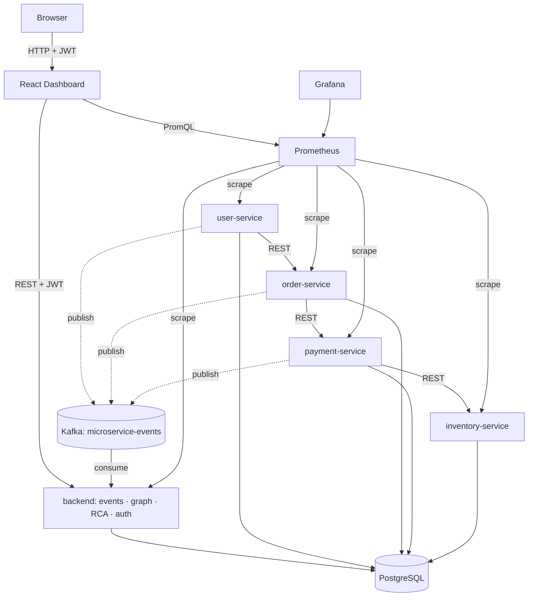

# CloudMicroserviceOps

A self-hosted monitoring and root-cause analysis platform for a distributed
Java microservices system: it observes real inter-service traffic, infers
the live dependency graph from that traffic, and ranks the most probable
root cause when a failure cascades across services.

## Problem statement

In a distributed microservices system, a single failing service often
produces symptoms in several other services at once, making it hard to find
the actual origin of an incident under time pressure. Hand-maintained
dependency diagrams drift out of date as soon as the code changes.

## Solution

CloudMicroserviceOps runs a small realistic microservice chain, observes
every inter-service call as a runtime event over Kafka, and uses that
observed traffic — not a static diagram — to build the dependency graph and
score root-cause candidates. A JWT-secured dashboard visualizes health,
metrics, the graph, and root-cause rankings in near real time, and a
built-in failure-simulation mode lets you trigger a real cascading failure
on demand to see the whole pipeline work end to end.

## Key features

- REST call chain across 4 independent Spring Boot services
  (user → order → payment → inventory)
- Every inter-service call publishes a runtime event to Kafka
- A backend service consumes those events and persists them to PostgreSQL
- Live dependency graph inferred from observed events (not hard-coded)
- Deterministic, explainable confidence scoring and root-cause ranking
- Controlled failure simulation (latency / error / CPU load) for demos and testing
- JWT authentication with role-based access control (VIEWER / OPERATOR / ADMIN)
- Prometheus + Grafana observability across every service
- A React dashboard tying all of the above together

## Architecture



## Technology stack

| Layer | Technology |
|---|---|
| Services | Java 21, Spring Boot 3.3, Maven |
| Security | Spring Security, JWT (jjwt) |
| Messaging | Apache Kafka (KRaft mode) |
| Database | PostgreSQL 16 |
| Metrics | Micrometer, Prometheus |
| Dashboards | Grafana |
| Frontend | React 18, TypeScript, Vite |
| Runtime | Docker, Docker Compose |

## Java components

- **`backend/`** — the platform service: consumes Kafka events, persists
  them, infers the dependency graph, ranks root causes, and issues/validates
  JWTs. Package layout: `controller`, `service`, `model`, `repository`,
  `kafka`, `graph` (dependency graph + confidence scoring), `rca`
  (root-cause analysis), `security` (JWT + Spring Security config), `dto`.
- **`microservices/`** — four independent Spring Boot services
  (`user-service`, `order-service`, `payment-service`, `inventory-service`),
  each with its own REST API, Postgres table, Kafka event publisher, and a
  `testing` package holding the failure-simulation feature and its JWT gate.

Each module builds and runs independently (`mvn -pl <module> package`),
aggregated by the root `pom.xml`.

## Docker / container architecture

`docker compose up -d` starts 10 containers: `postgres`, `kafka`, `backend`,
`user-service`, `order-service`, `payment-service`, `inventory-service`,
`prometheus`, `grafana`, `frontend` — one `docker-compose.yml`, no
orchestrator beyond Compose. All 5 Java services build to Spring Boot
executable JARs and run on `eclipse-temurin:21-jre-alpine`.

## Kafka event flow

Every outbound REST call between services publishes a `ServiceCallEvent` to
the `microservice-events` topic:

```json
{
  "eventId": "...", "timestamp": "...",
  "sourceService": "order-service", "targetService": "payment-service",
  "operation": "process-payment", "status": "SUCCESS", "durationMs": 115
}
```

`backend` subscribes to this topic and persists each event into the
`service_events` table — this table is the sole source of truth for
everything the graph and root-cause features compute.

## Dependency graph approach

`backend` groups `service_events` rows by `(sourceService, targetService)`
and computes, per pair: total calls, successful calls, failed calls, a
confidence score, and the last-observed time — live, on every request, with
no hard-coded edges. The confidence formula (`successfulCalls / totalCalls`)
lives in one dedicated class, `ConfidenceCalculator`, so it can be swapped
for something more sophisticated later without touching anything else.
Exposed via `GET /api/dependencies` (edge list) and
`GET /api/dependencies/graph` (nodes + edges, for visualization).

## Root-cause scoring approach

`RootCauseScorer` looks at recent `FAILURE` events within a time window,
finds the affected services, and scores each one with a deterministic
weighted sum: downstream blast radius (0.35) + confidence of the affected
incoming dependency (0.25) + share of total failures (0.25) + recency
(0.15). Results are ranked and paired with a plain-language reason (e.g.
*"failure occurred early and affected 1 downstream service(s)"*). Exposed via
`GET /api/incidents/root-causes?windowMinutes=N` (default 5). No ML — the
formula is intentionally simple and auditable.

## Authentication / RBAC

`backend` is the sole identity provider: `POST /api/auth/register` and
`POST /api/auth/login` issue a signed JWT carrying a role claim
(`VIEWER`, `OPERATOR`, or `ADMIN`; role hierarchy `ADMIN > OPERATOR >
VIEWER`). `backend` protects its own dashboard-data endpoints
(`/api/dependencies/**`, `/api/events/**`, `/api/incidents/**`) at `VIEWER`+.
Each business microservice independently validates the same JWT (shared
secret, no second identity provider) to gate its `/api/test/failure/**`
endpoints at `OPERATOR`+. `/actuator/health` and `/actuator/prometheus`
stay open on every service for infrastructure monitoring.

## Failure simulation

Each business microservice exposes testing-only endpoints, disabled by
default:

```
POST /api/test/failure/enable?type={HIGH_LATENCY|ERROR|CPU_LOAD}&durationMs=N
POST /api/test/failure/disable
GET  /api/test/failure/status
```

Implemented as a request filter that only affects real business traffic —
`/api/test/**` and `/actuator/**` are always exempt, so the simulation can
always be observed and turned off, and Prometheus/health checks stay
truthful while a failure is being demonstrated.

## Monitoring

Every Java service exposes Actuator + Micrometer metrics; Prometheus scrapes
all 5 (`backend` + 4 business services); Grafana ships with a provisioned
"CloudMicroserviceOps Overview" dashboard (service health, request rate,
error rate, p95 latency, CPU, memory). The React dashboard adds its own
System Status summary, service health, runtime metrics, live dependency
graph, root-cause ranking (with a prominent top-cause callout), and recent
events — all polled every 5–10 seconds.

## Running locally

```bash
cp .env.example .env       # adjust credentials/JWT secret as needed
docker compose up --build -d
```

Or build the Java modules directly with Maven (`mvn -DskipTests package`)
against a locally running Postgres/Kafka.

## Main URLs

| Component | URL |
|---|---|
| Frontend | http://localhost:3000 |
| Backend API | http://localhost:8080 |
| user-service | http://localhost:8081 |
| order-service | http://localhost:8082 |
| payment-service | http://localhost:8083 |
| inventory-service | http://localhost:8084 |
| Prometheus | http://localhost:9090 |
| Grafana | http://localhost:3001 |
| PostgreSQL | localhost:5432 |
| Kafka (host access) | localhost:9092 |

## Example failure demonstration

```bash
# register + log in as an OPERATOR
curl -s -X POST localhost:8080/api/auth/register -H 'Content-Type: application/json' \
  -d '{"username":"demo_operator","password":"DemoPass123","role":"OPERATOR"}'
TOKEN=$(curl -s -X POST localhost:8080/api/auth/login -H 'Content-Type: application/json' \
  -d '{"username":"demo_operator","password":"DemoPass123"}' | python3 -c "import sys,json;print(json.load(sys.stdin)['token'])")

# inject a payment failure
curl -X POST "localhost:8083/api/test/failure/enable?type=ERROR&durationMs=60000" -H "Authorization: Bearer $TOKEN"

# create a user and place an order — the chain fails at payment
curl -s -X POST localhost:8081/api/users -d '{"name":"Ada","email":"ada@example.com"}' -H 'Content-Type: application/json'
curl -s -X POST localhost:8081/api/users/1/orders -d '{"itemId":"widget","quantity":1}' -H 'Content-Type: application/json'
# -> order status "FAILED"

# ask who's responsible
curl -s "localhost:8080/api/incidents/root-causes?windowMinutes=10" -H "Authorization: Bearer $TOKEN"
# -> payment-service ranked #1, e.g. score 0.86-0.87,
#    reason "failure occurred early and affected 1 downstream service(s)"

curl -X POST "localhost:8083/api/test/failure/disable" -H "Authorization: Bearer $TOKEN"
```

## College MVP scope

**In scope and implemented:** the full pipeline above — REST call chain,
Kafka event flow, live dependency graph, deterministic root-cause ranking,
failure simulation, JWT auth + RBAC, Prometheus/Grafana monitoring, and the
React dashboard.

**Explicitly out of scope for this MVP:** Kubernetes, multi-cloud
orchestration, autonomous remediation, machine learning or LLM-based
scoring, predictive failure propagation, self-learning feedback loops, cloud
(AWS) deployment, and CI/CD. These are documented as future direction only.

## Verified end-to-end

The following were exercised against the running Docker Compose stack (not
just unit-tested) and confirmed working:

- Full 10-container stack deploys and stays up
- All 5 Java services build to executable JARs and start cleanly
- User → Order → Payment → Inventory REST chain, confirmed at every hop
- Kafka event generation and consumption (topic inspected directly)
- PostgreSQL persistence (`service_events` table queried directly)
- Dependency graph correctly derived from real observed events
- Failure simulation (`ERROR` mode) causing a real HTTP 500 and a
  propagated `FAILURE` event
- Root-cause ranking correctly identifying the injected failure's source
- JWT issuance, and rejection of tampered/expired tokens
- RBAC enforcement (VIEWER / OPERATOR / ADMIN) on both `backend` and the
  4 microservices' failure-simulation endpoints
- Prometheus scraping all 5 Java services successfully
- Grafana reachable with the provisioned dashboard
- Browser end-to-end: login, dashboard rendering for every role, logout,
  session persistence across refresh, and correct handling of an
  authentication failure (redirect, not stale data) — driven with a real
  headless-browser session, not simulated

Focused unit tests (`ConfidenceCalculatorTest`, `RootCauseScorerTest`,
`FailureSimulationServiceTest`, `JwtServiceTest`, `JwtValidatorTest`) pass in
isolation; the Spring context-load smoke tests additionally require a live
Postgres/Kafka, which the Docker Compose stack provides.

## Current limitations

- Self-registration lets a caller pick their own role, including `ADMIN` —
  acceptable for a college demo with no pre-existing admin to bootstrap
  from, not appropriate for production.
- Confidence scoring and root-cause ranking use simple, deterministic
  formulas by design — no statistical or ML modeling.
- Dependency analysis looks at direct edges only; deeper transitive graph
  traversal is not implemented.
- No user-management UI (accounts are managed via the API only).
- Prometheus and Grafana are intentionally left unauthenticated.
- Single shared PostgreSQL database/instance for all services.
- Default JWT secret and default credentials must be overridden via `.env`
  for anything beyond local demo use.

## Future enhancements

- Kubernetes-based deployment and multi-cloud orchestration
- Autonomous remediation actions triggered from root-cause results
- Statistical or ML-based confidence and root-cause scoring
- Transitive dependency graph analysis
- Incident management workflow and admin/user-management UI
- Cloud (AWS) deployment and CI/CD pipeline
